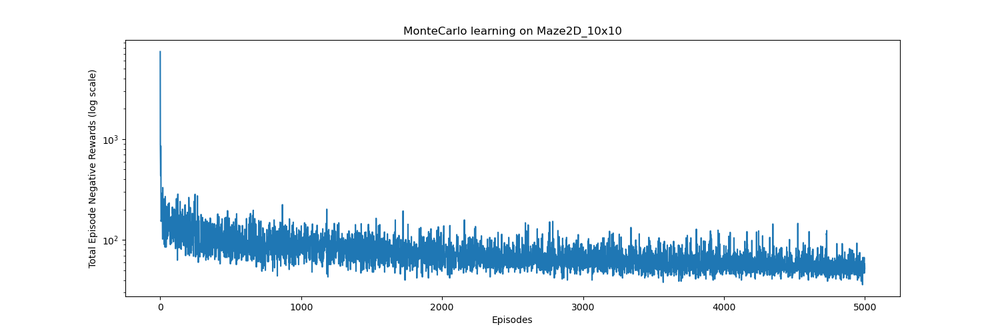
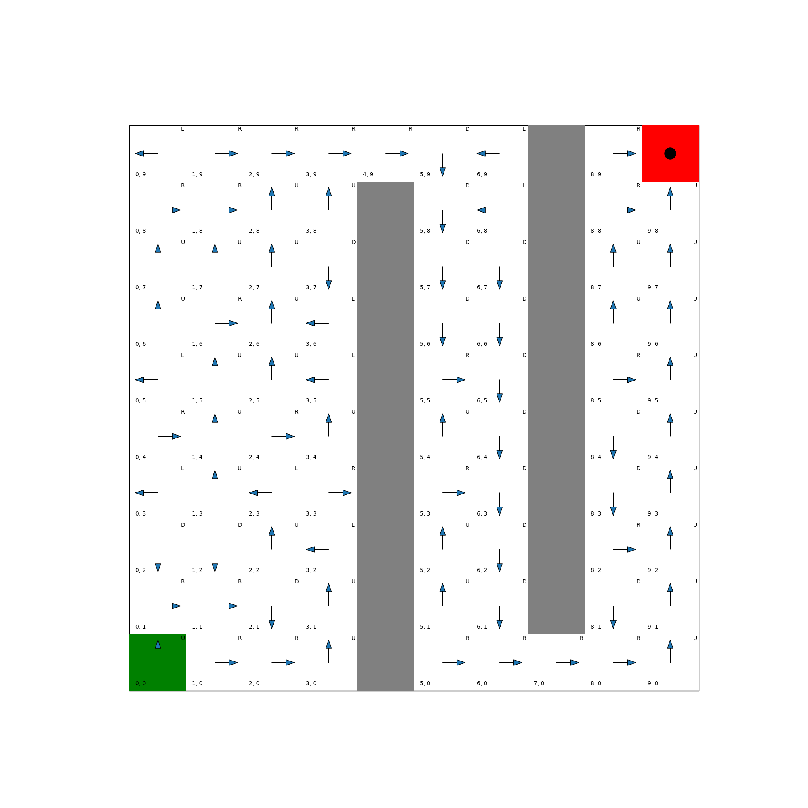

# Examples

## Monte Carlo control and Maze2D

We used the classical Monte Carlo method to learn state-action values for a 2D maze environment. The learning was on-policy, we used an epsilon-greedy policy based on the current state-action values, exponentially decaying epsilon as learning progressed to decrease exploration. 

The negative rewards per episode are shown below.



The final, deterministic greedy policy is shown below:



The experiment can be reproduced by running:

```bash
python maze_montecarlo_learning.py
```

Edit the file to change the maze setup or learning parameters.