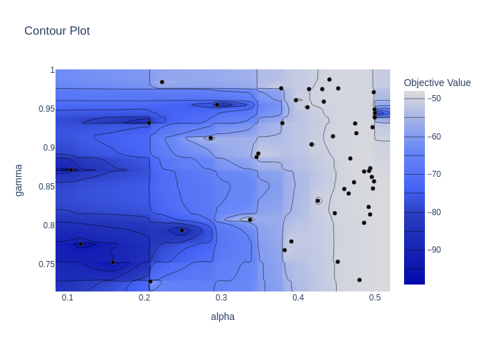
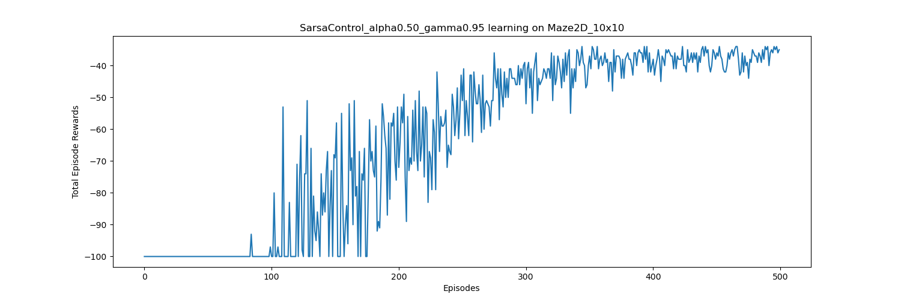

# Examples

## Monte Carlo control and Maze2D

We used the classical Monte Carlo method to learn state-action values for a 2D maze environment. The learning was on-policy, we used an epsilon-greedy policy based on the current state-action values, exponentially decaying epsilon as learning progressed to decrease exploration. 

The negative rewards per episode are plotted:


The final, near optimal, action selection by the greedy policy is shown below:


The experiment can be reproduced by running:

```bash
python examples.py maze_montecarlo
```

Edit the file to change the maze setup or learning parameters.

## Tuning SARSA hyperparameters with Optuna

The goal of this experiment was to tune the `alpha` and `gamma` parameters for SARSA on Maze2D. We optimized for KPI that incorporates both the final greedy policy reward and the speed of learning for the final policy. For efficiency, we limit terminate the episodes (if necessary) after 100 steps (the optimal policy ends in 34 steps).

The plot below shows the contour plot for the tested hyperparameters:



The following two figures show the rewards during learning and final policy for the best parameters:



It is evident that SARSA is much faster than MC in learning and the final policy is overall better:


The experiment can be reproduced by running:

```bash
python examples.py sarsa_hyperparameter
```
